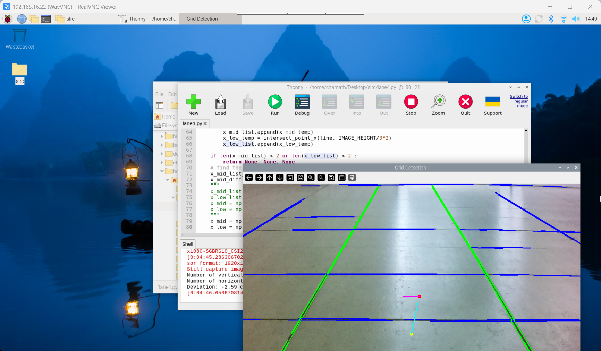
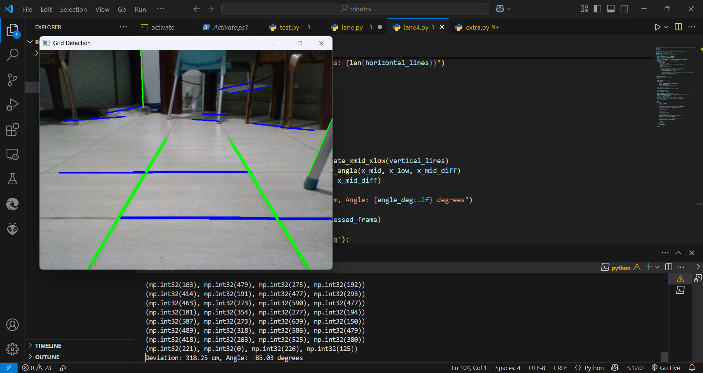

# Lane Detector

Lane detector is a Python project that uses computer vision to detect lane boundaries for robot car navigation. It calculates both linear and angular deviation from the center of the lane and communicates the data to the motor controller ESP via serial communication.

⚒️ Technology Stack
- Raspberry Pi model 4B+
- Computer vision with opencv-python

Results from Raspberry Pi | Resultls from PC
--|--
 | 
